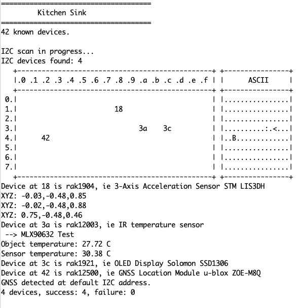

# RAK4631_Kitchen_Sink

A self-test application for the RAK4631. I runs an I2C scanner against a list of know RAKwireless I2C modules. It runs a quick test against each module found.

For the moment the available tests are:

* testRAK1901
* testRAK1904
* testRAK1906
* testRAK1921
* testRAK12003
* testRAK12008
* testRAK12011
* testRAK12019
* testRAK12500

I'll keep adding tests.

